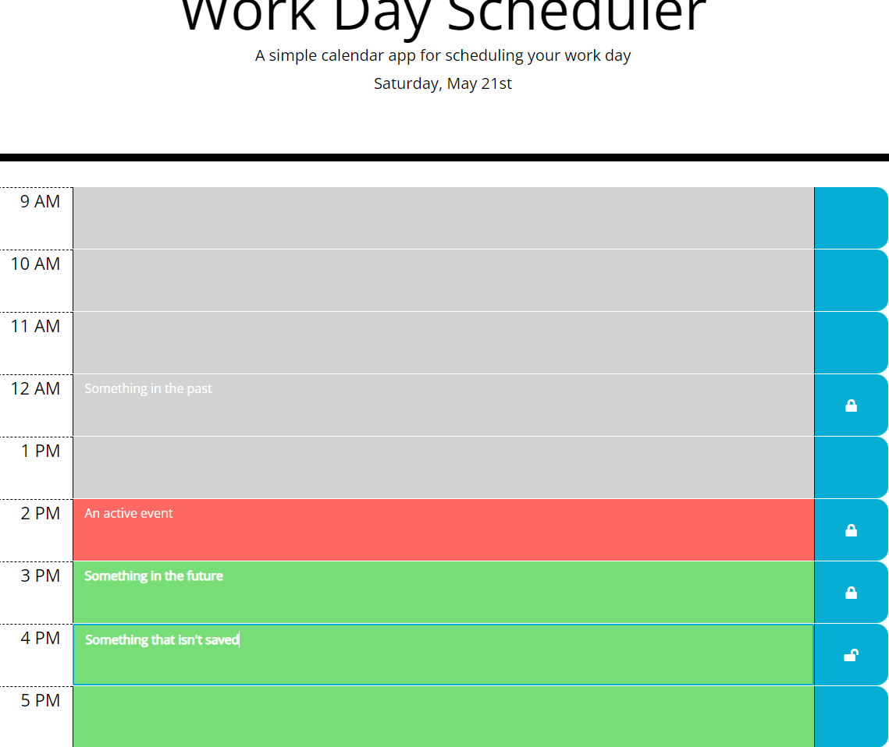
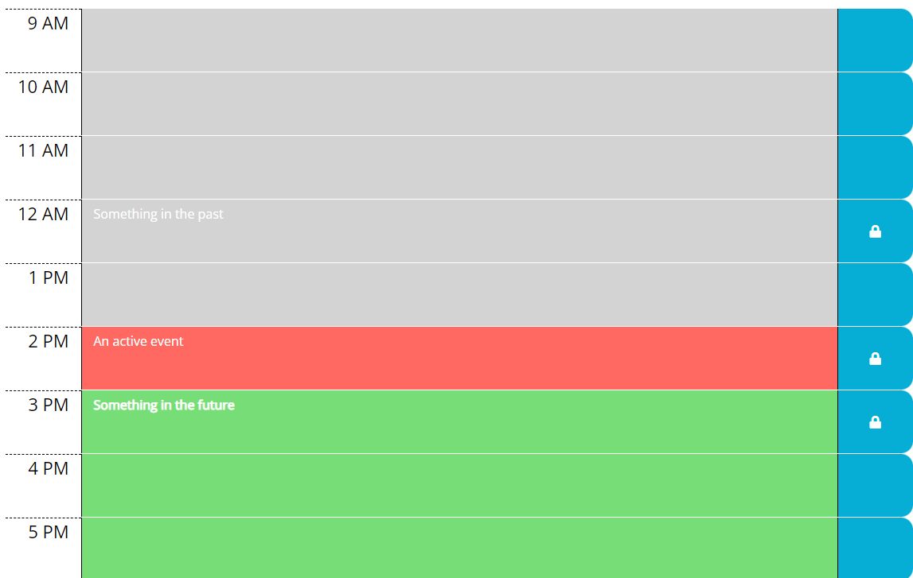
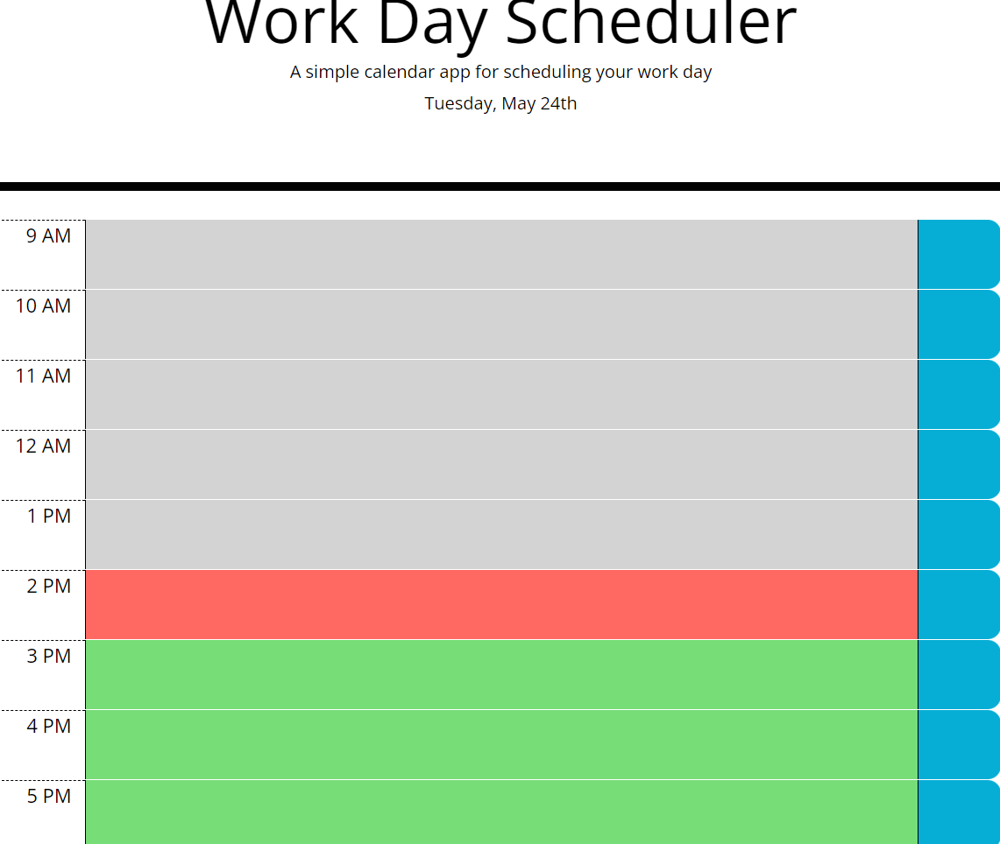

# 05 Third-Party APIs: Work Day Scheduler

## Your Task

Create a simple calendar application that allows a user to save events for each hour of the day by modifying starter code. This app will run in the browser and feature dynamically updated HTML and CSS powered by jQuery.

You'll need to use the [Moment.js](https://momentjs.com/) library to work with date and time. Be sure to read the documentation carefully and concentrate on using Moment.js in the browser.

## User Story

```md
AS AN employee with a busy schedule
I WANT to add important events to a daily planner
SO THAT I can manage my time effectively
```

## Acceptance Criteria

```md
GIVEN I am using a daily planner to create a schedule
WHEN I open the planner
THEN the current day is displayed at the top of the calendar
WHEN I scroll down
THEN I am presented with timeblocks for standard business hours
WHEN I view the timeblocks for that day
THEN each timeblock is color coded to indicate whether it is in the past, present, or future
WHEN I click into a timeblock
THEN I can enter an event
WHEN I click the save button for that timeblock
THEN the text for that event is saved in local storage
WHEN I refresh the page
THEN the saved events persist
```

# About #
```
At the very top of the screen, below the title, you will the current date.
An office hours working day will be presented in blocks of one hour, labeled on the left with the time they represent.
On the right of each hour is a blue save button.
This save button will be blank if there is no information in the corresponding block, it will have an unlocked icon if there is unsaved information, and a locked icon if there is information that is saved.
Clicking on the button will save the information inside the text area.
```

```
Reloading the page will retireve saved information.
Unsaved information is lost when reloading the page.
```

```
Every day, the schedule is deleted, regardless of whether or not it was saved.
```

